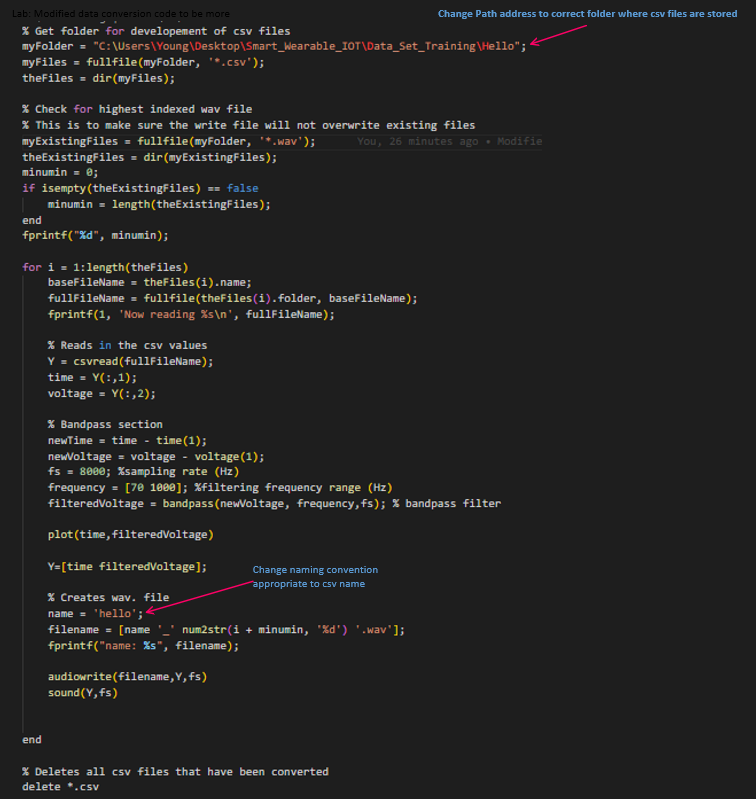

# How collect and transform data from csv to wav format

Each folder has a seperate matlab file that will automatically change all csv files within the folder approprately. 

Update the path of the folder within the Matlab code so it knows the search area. Also need to change the ouput naming convention. The code automatically ensure you dont have any duplicates when making new Wav files, (name.wav, name_1.wave, name_2.wav, etc...)

When Recording sample data from Digilent use the following settings:
- Base: 100 ms/div
- Rate: 8 Khz

- Offset: -1.5V
- Range: 50mV/div

Exporting data: 
- Turn off comments and headers
- Leave Labels on

## To use this code, you need the addons on MATLAB: 

DataONEorg/matlab-dataone
version 1.0.0.0 (64.5 MB) by Christopher Jones

Signal Processing Toolbox